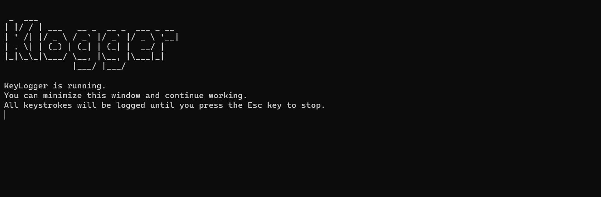

# Klogger - Open Source KeyLogger

Klogger is an open-source, cross-platform keylogger developed in Python. It is designed for educational use and ethical penetration testing, helping users understand security risks and improve system defenses.

## Usage Instructions

1. **Download Klogger**  
    - Visit the [GitHub Releases](https://github.com/AbhayJha24/keylogger/releases) page.
    - Download the latest release suitable for your operating system.

2. **Run Klogger**  
    <!-- *Extract the downloaded files to a folder of your choice.* -->
    > For Windows: Double-click the `klogger.exe` file to run Klogger.

    >For macOS/Linux: Open a terminal in the folder and run the executable for your OS (e.g., `./klogger`).

3. **Recording Keystrokes**  
    - Once started, Klogger will record all keystrokes.
    - All logged keys are saved in a file named `log.txt` in the same folder.

4. **Minimize and Use Normally**  
    - You can minimize Klogger and continue using your computer as usual.
    - Klogger works in the background.

5. **Stopping Klogger**  
    - To stop Klogger, press the `Esc` key on your keyboard.
    - The application will exit and save the log file.

> **Note:** Use Klogger only for ethical and educational purposes. Always obtain proper authorization before running it on any system.